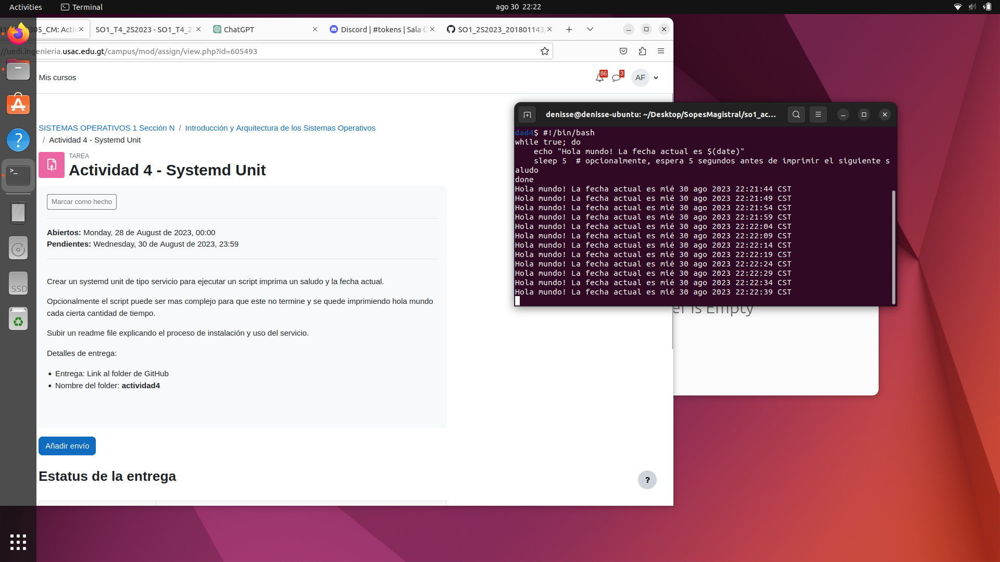

El proceso de creación del Script

## 1. Creación del script el saludo y la fecha. 

    #!/bin/bash
while true; do
    echo "Hola mundo! La fecha actual es $(date)"
    sleep 5 
done

## 2. Guardar el Script

chmod +x /home/denisse/Desktop/SopesMagistral/so1_actividades_201801143/hello_script.sh
